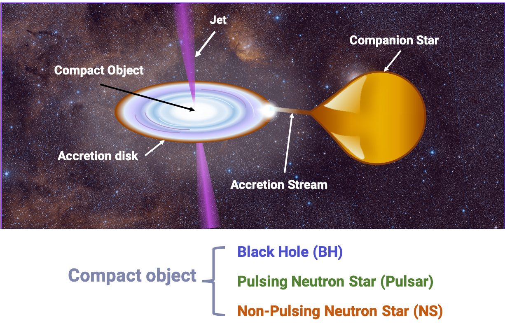

# X-ray Binary ML: 3 Machine Learning Methods for Classifying the Compact Objects in X-ray Binaries

**What are X-ray Binaries?** X-ray  binaries  (XRBs)  consist  of  a  compact  object accreting  matter  from  a  main  sequence  or  supergiant companion  star,  orbiting  the  common  center  of  mass.

## Code Author

Zoe de Beurs: [@zdebeurs](https://github.com/zdebeurs)

We customized code from the LIBSVM library (Chang & Lin 2011), the class package (Venables & Ripley 2002), and the Kernlab library (Karatzoglou et al. 2004).

## Background

This directory contains Machine Learning Algorithms (Bayesian Gaussian Process,
 K-Nearest Neighbors, Support Vector Machines) for classifying the compact objects
  in X-ray Binaries. For more details, see [our live-broadcasted talk](https://youtu.be/c6SgxjjYLPk) at the SAO Astronomy Summer Intern Symposium 2019. 
  
## Citation

If you use any part of this code, please cite our paper:

de Beurs, Z. L., Islam, N., Gopalan, G., & Vrtilek, S.D. (2020). A Comparative Study of Machine Learning Methods for X-ray Binary Classification. Accepted to the Astrophysical Journal. https://ui.adsabs.harvard.edu/abs/2022arXiv220400346D/abstract

## Figures from the paper in 3D Animations

To examine the 3D Color-Color-Intensity Diagrams, go to **[Figures](https://github.com/zdebeurs/3ML_methods_for_XRB_classification/tree/master/Figures)**

# Walkthrough

## Setup

First, ensure that you have installed required packages in R:

* **ggplot2** ([instructions](https://ggplot2.tidyverse.org/))
* **caret** ([instructions](https://cran.r-project.org/web/packages/caret/index.html)) 
* **e1071** ([instructions](https://cran.r-project.org/web/packages/e1071/index.html/)) 
* **lhs** ([instructions](https://cran.r-project.org/web/packages/lhs/index.html)
* **doFuture** ([instructions](https://cran.r-project.org/web/packages/doFuture/index.html/))
* **kernlab** ([instructions]([https://cran.r-project.org/web/packages/doFuture/index.html/](https://cran.r-project.org/web/packages/kernlab/index.html)))

## Running the scripts

1. To subsample the MAXI data used in de Beurs et al. 2022, run `Sampling_method_10_subsets.R` in R/Rstudio
2. Next, adjust the paths at the top of `KNN_methods/KNN_cross_val_compute_predictions.R` to match the local direcory you want the results to be written to.
3. Run `KNN_methods/KNN_cross_val_compute_predictions.R` to perform the KNN analysis
4. Run `KNN_methods/KNN_plot_predictions.R` to plot the results of your KNN analysis
5. Adjust the paths at the top of `SVM_methods/SVM_cross_val_compute_predictions.R` to match the local direcory you want the results to be written to.
6. Run `SVM_methods/SVM_cross_val_compute_predictions.R` to perform the SVM analysis
7. Run  `SVM_methods/SVM_Median_SD_calculation.R` to aggregate your results and compute the median and sd across the ten subsampled datasets
8. Run `SVM_methods/SVM _plot_predictions_10_runs.R`  to plot the results of your KNN analysis

For the Bayesian Gaussian Process analysis, you will need to run these scripts on a supercomputing cluster. If you do not have access to a supercomputer, we suggest you decrease the sampling rate in `Sampling_method_10_subsets.R` from 20% to 10% to decrease computational time.
1. Copy the folder `Training_and_Testing_saku_Dec3` to the supercomputer and run `BGP_methods/BGP_folder_maker_by_class.R` to sort the predictions into the appropriate folder (BGP/NS/Pulsar) for plotting.
2. Run `BGP_methods/Feb10_parallel_0.4_cutoff_bursters_laplacedot_kernel.R` on your supercomputer cluster. This can usually be done using a scheduler such as slurm. Please refer to resources of your specific cluster for more details on this.
3. Copy the results folder `BGP_results` to your personal computer.
4. Now on your personal computer, adjust the paths at the top of `BGP_plot_predictions.R` to match your input and output directories.
5. Run `BGP_methods/BGP_plot_predictions.R` to plot your BGP results.

If you use any part of this code, please cite our paper:
de Beurs, Z. L., Islam, N., Gopalan, G., & Vrtilek, S.D. (2020). A Comparative Study of Machine Learning Methods for X-ray Binary Classification. Accepted to the Astrophysical Journal. https://ui.adsabs.harvard.edu/abs/2022arXiv220400346D/abstract

